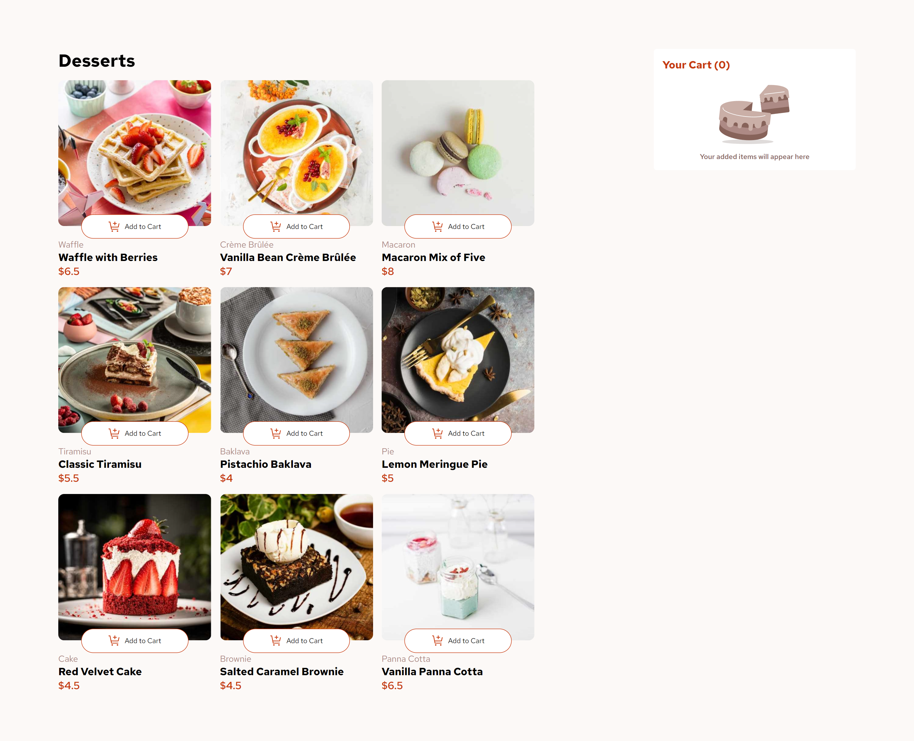

# Frontend Mentor - Product list with cart solution

This is a solution to the [Product list with cart challenge on Frontend Mentor](https://www.frontendmentor.io/challenges/product-list-with-cart-5MmqLVAp_d). Frontend Mentor challenges help you improve your coding skills by building realistic projects. 

## Table of contents

- [Overview](#overview)
  - [The challenge](#the-challenge)
  - [Screenshot](#screenshot)
  - [Links](#links)
- [My process](#my-process)
  - [Built with](#built-with)
  - [What I learned](#what-i-learned)
- [Author](#author)

## Overview

### The challenge

Users should be able to:

- Add items to the cart and remove them
- Increase/decrease the number of items in the cart
- See an order confirmation modal when they click "Confirm Order"
- Reset their selections when they click "Start New Order"
- View the optimal layout for the interface depending on their device's screen size
- See hover and focus states for all interactive elements on the page

### Screenshot

### Links

- Solution URL: [solution URL here](https://madhukar-30.github.io/Product-List-Manager/)
- Live Site URL: [ live site URL here](https://github.com/madhukar-30/Product-List-Manager.git)

## My process

### Built with

- CSS custom properties
- Flexbox
- CSS Grid
- JavaScript

### What I learned

I recently learned how to dynamically populate a user interface using data from a JSON file.

## Author
- Frontend Mentor - [@madhukar-30](https://www.frontendmentor.io/profile/madhukar-30)

